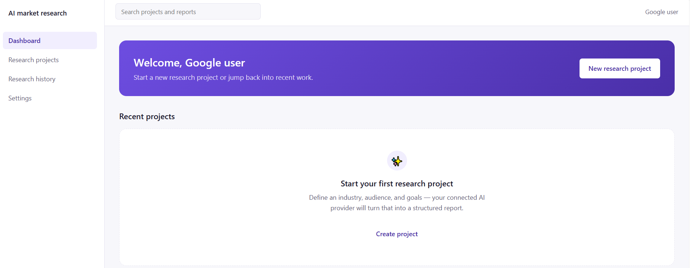
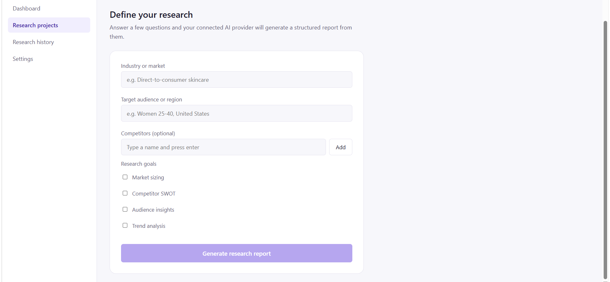
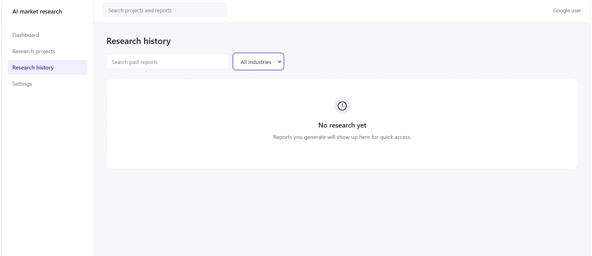
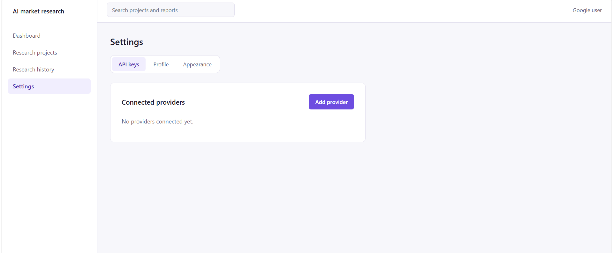

# 📊 AI Market Research Assistant

Generate structured market research reports — bring your own AI key (OpenAI, Anthropic, Gemini).

---

## 🚀 Live Demo

**[Try it here](https://mfaizan9218.github.io/ai-market-research-assistant/)**

---

## ✨ Features

- **BYOAI Architecture** — Bring your own API key (OpenAI, Anthropic, Gemini). Your key stays local.
- **Structured Reports** — Generate market sizing, competitor SWOT, audience insights, and trend analysis.
- **Editable Sections** — Each report section is editable and can be regenerated individually.
- **Project Management** — Save, organize, and revisit your research projects.
- **Search & Filter** — Quickly find past research by name or industry.
- **Export to PDF** — Print or save your reports as PDF.
- **Dark/Light Mode** — Works in any environment.

---

## 📸 Screenshots

### Dashboard
Overview of your research projects.

---

### Research Builder
Define your industry, audience, and goals.

---

### Report Viewer
View, edit, and regenerate sections.

---

### Settings
Manage your API keys and preferences.

---

## 🛠️ Tech Stack

- Vanilla JavaScript
- LocalStorage for persistence
- Multiple AI Provider APIs (BYOAI)

---

## 🔧 How to Use

1. Open the tool
2. Connect your AI provider API key (Settings)
3. Define your industry, audience, and goals
4. Generate a structured market research report
5. Edit, regenerate, and export

---

## 🔒 Privacy

- No data is sent to any server except your chosen AI provider
- Your API key is stored in your browser's localStorage
- All research stays in your browser's localStorage

---

## 🤝 Connect with Me

- **GitHub:** [github.com/mfaizan9218](https://github.com/mfaizan9218)
- **LinkedIn:** [linkedin.com/in/m-faizan-sheikh-0875982a7](https://linkedin.com/in/m-faizan-sheikh-0875982a7)

---
